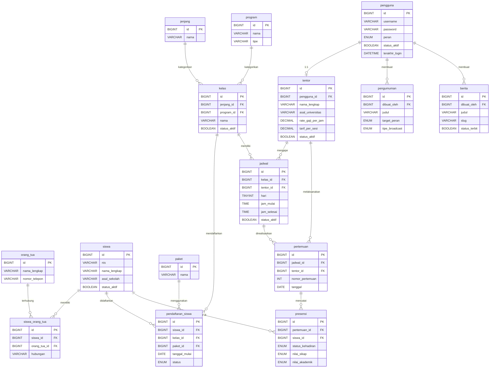

# Backend Documentation — SIATAMA

> **Versi Dokumen:** `1.0.0`  
> **Terakhir Diperbarui:** 2026-09-21  
> **Stack:** PHP Native (No Framework) · MySQL · PDO  
> **Entry Point:** `public/index.php`

---

## Daftar Isi

1. [Arsitektur & Struktur Folder](#1-arsitektur--struktur-folder)
2. [Layer Core (Bootstrap)](#2-layer-core-bootstrap)
   - [Router](#21-router)
   - [Model Base](#22-model-base)
   - [Controller Base](#23-controller-base)
3. [Database](#3-database)
   - [Konfigurasi Koneksi](#31-konfigurasi-koneksi)
   - [Schema & Tabel](#32-schema--tabel)
   - [Entity-Relationship Diagram](#33-entity-relationship-diagram)
4. [Models](#4-models)
5. [Controllers](#5-controllers)
   - [AuthController](#51-authcontroller)
   - [Admin — DashboardController](#52-admin--dashboardcontroller)
   - [Admin — PenggunaController](#53-admin--penggunacontroller)
   - [Admin — JenjangController](#54-admin--jenjangcontroller)
   - [Admin — KelasController](#55-admin--kelascontroller)
   - [Admin — TentorController](#56-admin--tentorcontroller)
   - [Admin — SiswaController](#57-admin--siswacontroller)
   - [Admin — PendaftaranSiswaController](#58-admin--pendaftaransiswacontroller)
   - [Admin — JadwalController](#59-admin--jadwalcontroller)
   - [Admin — PertemuanController](#510-admin--pertemuancontroller)
   - [Admin — PengumumanController](#511-admin--pengumumancontroller)
   - [Admin — BeritaController](#512-admin--beritacontroller)
   - [Admin — LaporanController](#513-admin--laporancontroller)
   - [Tentor — DashboardController](#514-tentor--dashboardcontroller)
   - [Tentor — AkademikController](#515-tentor--akademikcontroller)
   - [PublicController](#516-publiccontroller)
6. [Route Map](#6-route-map)
7. [Support & Helpers](#7-support--helpers)
8. [Changelog](#8-changelog)

---

## 1. Arsitektur & Struktur Folder

Aplikasi ini menggunakan arsitektur **MVC (Model-View-Controller)** sederhana yang dibangun dari nol tanpa framework pihak ketiga.

```
siatama-private/
├── app/
│   ├── Controllers/
│   │   ├── Admin/          ← Controller khusus role admin/owner
│   │   ├── Tentor/         ← Controller khusus role tentor
│   │   ├── AuthController.php
│   │   └── PublicController.php
│   ├── Core/
│   │   ├── Controller.php  ← Base controller
│   │   ├── Model.php       ← Base model (CRUD generik via PDO)
│   │   └── Router.php      ← Custom HTTP router
│   ├── Data/
│   │   └── AdminDashboardData.php  ← Data aggregator dashboard
│   ├── Models/             ← Model per entitas DB
│   ├── Support/
│   │   └── helpers.php     ← Fungsi utilitas global
│   └── Views/              ← Template PHP (render via Controller)
├── config/
│   └── database.php        ← Konfigurasi & singleton PDO
├── database/
│   ├── schema.sql          ← DDL lengkap
│   └── seed.sql            ← Data awal
└── public/
    ├── index.php           ← Entry point & pendaftaran route
    └── router.php          ← PHP built-in server router
```

**Alur Request:**
```
HTTP Request
    → public/index.php      (autoload, session, require helpers)
    → Router::dispatch()    (matching pattern, ekstrak param)
    → Controller::method()  (validasi, ambil data, render/redirect)
    → Model::method()       (query PDO ke MySQL)
    → View (PHP template)
```

---

## 2. Layer Core (Bootstrap)

### 2.1 Router

**File:** [`app/Core/Router.php`](../../app/Core/Router.php)

Router custom yang mendukung parameter dinamis `{param}` dan HTTP method GET/POST.

#### Method

| Method | Signature | Return | Keterangan |
|--------|-----------|--------|------------|
| `get` | `get(string $path, array\|callable $handler): void` | `void` | Daftarkan route GET |
| `post` | `post(string $path, array\|callable $handler): void` | `void` | Daftarkan route POST |
| `dispatch` | `dispatch(string $method, string $uri): void` | `void` | Cocokkan URL → jalankan handler |

**Cara Kerja `dispatch`:**
1. Parse URI menggunakan `parse_url()`, normalisasi trailing slash
2. Loop seluruh route yang terdaftar, cek `$route['method'] === $method`
3. Jalankan `preg_match()` dengan pattern regex (konversi `{id}` → `(?P<id>[^/]+)`)
4. Ekstrak named groups dari `$matches` sebagai `$params`
5. Jika handler berupa `[Controller::class, 'method']`, instansiasi controller dan panggil method dengan spread `$params`
6. Jika tidak ada yang cocok → `http_response_code(404)` + render `Views/404.php`

---

### 2.2 Model Base

**File:** [`app/Core/Model.php`](../../app/Core/Model.php)  
**Namespace:** `App\Core`

Abstract class yang menyediakan operasi CRUD generik berbasis PDO. Semua model konkret meng-extend class ini.

#### Properties

| Property | Type | Default | Keterangan |
|----------|------|---------|------------|
| `$db` | `PDO` | — | Instance PDO dari `getDBConnection()` |
| `$table` | `string` | — | Nama tabel DB (wajib di-override) |
| `$primaryKey` | `string` | `'id'` | Nama kolom primary key |

#### Method

| Method | Signature | Return | Query yang dijalankan |
|--------|-----------|--------|-----------------------|
| `all` | `all(): array` | `array` (assoc) | `SELECT * FROM {table} ORDER BY {pk} DESC` |
| `find` | `find(int\|string $id): ?array` | `array\|null` | `SELECT * FROM {table} WHERE {pk} = :id LIMIT 1` |
| `create` | `create(array $data): int\|string` | `lastInsertId` | `INSERT INTO {table} (cols) VALUES (placeholders)` |
| `update` | `update(int\|string $id, array $data): bool` | `bool` | `UPDATE {table} SET col=:col WHERE {pk} = :_primary_id` |
| `delete` | `delete(int\|string $id): bool` | `bool` | `DELETE FROM {table} WHERE {pk} = :id` |

> **Catatan:** Semua query menggunakan **prepared statements** dengan named placeholder (`:nama`) untuk menghindari SQL injection.

---

### 2.3 Controller Base

**File:** [`app/Core/Controller.php`](../../app/Core/Controller.php)  
**Namespace:** `App\Core`

#### Method

| Method | Signature | Return | Keterangan |
|--------|-----------|--------|------------|
| `render` | `render(string $viewPath, array $data = [], string $layout = 'admin/layout'): void` | `void` | Extract `$data` ke scope, include layout → layout include view via `$contentView` |
| `redirect` | `redirect(string $url): void` | `void` | `header('Location: ...')` + `exit` |
| `json` | `json(array $data, int $statusCode = 200): void` | `void` | Set header JSON, `json_encode` + `exit` |

---

## 3. Database

### 3.1 Konfigurasi Koneksi

**File:** [`config/database.php`](../../config/database.php)

| Konstanta | Default | Env Variable |
|-----------|---------|--------------|
| `DB_HOST` | `127.0.0.1` | `DB_HOST` |
| `DB_PORT` | `3306` | `DB_PORT` |
| `DB_NAME` | `bimbel_db` | `DB_NAME` |
| `DB_USER` | `root` | `DB_USER` |
| `DB_PASS` | `''` | `DB_PASS` |

**Fungsi `getDBConnection(): PDO`**
- Menggunakan **singleton pattern** (`static $pdo = null`) — hanya satu instance PDO per request
- DSN: `mysql:host=...;port=...;dbname=...;charset=utf8mb4`
- PDO Options:
  - `ERRMODE_EXCEPTION` — semua error melempar `PDOException`
  - `FETCH_ASSOC` — fetch default sebagai associative array
  - `EMULATE_PREPARES = false` — prepared statement native MySQL
- Jika koneksi gagal → `error_log` + throw `Exception` dengan pesan ramah

---

### 3.2 Schema & Tabel

**File:** [`database/schema.sql`](../../database/schema.sql)

#### Tabel `pengguna`
| Kolom | Tipe | Constraint | Keterangan |
|-------|------|------------|------------|
| `id` | `BIGINT` | PK, AUTO_INCREMENT | — |
| `username` | `VARCHAR(50)` | NOT NULL, UNIQUE | Nama login |
| `password` | `VARCHAR(255)` | NOT NULL | Hash `password_hash()` |
| `peran` | `ENUM('owner','admin','tentor')` | NOT NULL | Role akses sistem |
| `status_aktif` | `BOOLEAN` | DEFAULT TRUE | Akun aktif/nonaktif |
| `terakhir_login` | `DATETIME` | NULL | Diupdate saat login berhasil |
| `dibuat_pada` | `DATETIME` | DEFAULT CURRENT_TIMESTAMP | — |
| `diubah_pada` | `DATETIME` | ON UPDATE CURRENT_TIMESTAMP | — |

---

#### Tabel `tentor`
| Kolom | Tipe | Constraint | Keterangan |
|-------|------|------------|------------|
| `id` | `BIGINT` | PK, AUTO_INCREMENT | — |
| `pengguna_id` | `BIGINT` | NOT NULL, UNIQUE, FK→pengguna | 1:1 dengan akun |
| `nama_lengkap` | `VARCHAR(100)` | NOT NULL | — |
| `asal_universitas` | `VARCHAR(150)` | NOT NULL | — |
| `nomor_telepon` | `VARCHAR(20)` | NULL | — |
| `bio` | `TEXT` | NULL | — |
| `foto` | `VARCHAR(255)` | NULL | Path relatif `/uploads/tentor/...` |
| `rate_gaji_per_jam` | `DECIMAL(12,2)` | DEFAULT 0 | Dipakai jika `tarif_per_sesi = 0` |
| `tarif_per_sesi` | `DECIMAL(12,2)` | DEFAULT 0 | Prioritas utama kalkulasi honorarium |
| `status_aktif` | `BOOLEAN` | DEFAULT TRUE | — |
| `dibuat_pada` | `DATETIME` | — | — |
| `diubah_pada` | `DATETIME` | — | — |

**FK:** `fk_tentor_pengguna` → `pengguna.id` ON DELETE CASCADE

---

#### Tabel `orang_tua`
| Kolom | Tipe | Constraint | Keterangan |
|-------|------|------------|------------|
| `id` | `BIGINT` | PK, AUTO_INCREMENT | — |
| `nama_lengkap` | `VARCHAR(100)` | NOT NULL | — |
| `nomor_telepon` | `VARCHAR(20)` | NOT NULL | — |
| `dibuat_pada` | `DATETIME` | — | — |
| `diubah_pada` | `DATETIME` | — | — |

---

#### Tabel `siswa`
| Kolom | Tipe | Constraint | Keterangan |
|-------|------|------------|------------|
| `id` | `BIGINT` | PK, AUTO_INCREMENT | — |
| `nis` | `VARCHAR(30)` | NULL, UNIQUE | Nomor Induk Siswa (opsional) |
| `nama_lengkap` | `VARCHAR(100)` | NOT NULL | — |
| `asal_sekolah` | `VARCHAR(150)` | NOT NULL | — |
| `status_aktif` | `BOOLEAN` | DEFAULT TRUE | — |
| `dibuat_pada` | `DATETIME` | — | — |
| `diubah_pada` | `DATETIME` | — | — |

---

#### Tabel `siswa_orang_tua` _(pivot / junction)_
| Kolom | Tipe | Constraint | Keterangan |
|-------|------|------------|------------|
| `id` | `BIGINT` | PK | — |
| `siswa_id` | `BIGINT` | FK→siswa | — |
| `orang_tua_id` | `BIGINT` | FK→orang_tua | — |
| `hubungan` | `VARCHAR(30)` | NOT NULL | Contoh: `Ayah`, `Ibu`, `Wali` |

**FK:**
- `fk_siswa_orangtua_siswa` → `siswa.id` ON DELETE CASCADE
- `fk_siswa_orangtua_ortu` → `orang_tua.id` ON DELETE CASCADE

---

#### Tabel `jenjang`
| Kolom | Tipe | Constraint | Keterangan |
|-------|------|------------|------------|
| `id` | `BIGINT` | PK, AUTO_INCREMENT | — |
| `nama` | `VARCHAR(50)` | NOT NULL | Contoh: `SD`, `SMP/MTs`, `SMA/MA` |

---

#### Tabel `program`
| Kolom | Tipe | Constraint | Keterangan |
|-------|------|------------|------------|
| `id` | `BIGINT` | PK, AUTO_INCREMENT | — |
| `nama` | `VARCHAR(50)` | NOT NULL | Contoh: `Reguler`, `Intensif`, `Private` |
| `tipe` | `VARCHAR(30)` | NOT NULL | Tipe program bimbel |

---

#### Tabel `paket`
| Kolom | Tipe | Constraint | Keterangan |
|-------|------|------------|------------|
| `id` | `BIGINT` | PK, AUTO_INCREMENT | — |
| `nama` | `VARCHAR(50)` | NOT NULL | Nama paket bimbel |

---

#### Tabel `kelas`
| Kolom | Tipe | Constraint | Keterangan |
|-------|------|------------|------------|
| `id` | `BIGINT` | PK, AUTO_INCREMENT | — |
| `jenjang_id` | `BIGINT` | NOT NULL, FK→jenjang | — |
| `program_id` | `BIGINT` | NOT NULL, FK→program | — |
| `nama` | `VARCHAR(20)` | NOT NULL | Contoh: `7A`, `12 IPA` |
| `status_aktif` | `BOOLEAN` | DEFAULT TRUE | — |
| `dibuat_pada` | `DATETIME` | — | — |
| `diubah_pada` | `DATETIME` | — | — |

**FK:**
- `fk_kelas_jenjang` → `jenjang.id` ON DELETE RESTRICT
- `fk_kelas_program` → `program.id` ON DELETE RESTRICT

---

#### Tabel `pendaftaran_siswa`
| Kolom | Tipe | Constraint | Keterangan |
|-------|------|------------|------------|
| `id` | `BIGINT` | PK, AUTO_INCREMENT | — |
| `siswa_id` | `BIGINT` | NOT NULL, FK→siswa | — |
| `kelas_id` | `BIGINT` | NOT NULL, FK→kelas | — |
| `paket_id` | `BIGINT` | NULL, FK→paket | Paket bimbel (opsional) |
| `tanggal_mulai` | `DATE` | NOT NULL | — |
| `tanggal_selesai` | `DATE` | NULL | Diisi saat status → `selesai` |
| `status` | `ENUM('aktif','selesai')` | DEFAULT `aktif` | — |
| `dibuat_pada` | `DATETIME` | — | — |
| `diubah_pada` | `DATETIME` | — | — |

**FK:**
- `fk_pendaftaran_siswa` → `siswa.id` ON DELETE CASCADE
- `fk_pendaftaran_kelas` → `kelas.id` ON DELETE RESTRICT
- `fk_pendaftaran_paket` → `paket.id` ON DELETE SET NULL

---

#### Tabel `jadwal`
| Kolom | Tipe | Constraint | Keterangan |
|-------|------|------------|------------|
| `id` | `BIGINT` | PK, AUTO_INCREMENT | — |
| `kelas_id` | `BIGINT` | NOT NULL, FK→kelas | — |
| `tentor_id` | `BIGINT` | NOT NULL, FK→tentor | — |
| `hari` | `TINYINT` | NOT NULL | `1`=Senin … `7`=Minggu |
| `jam_mulai` | `TIME` | NOT NULL | — |
| `jam_selesai` | `TIME` | NOT NULL | — |
| `ruangan` | `VARCHAR(50)` | NULL | — |
| `status_aktif` | `BOOLEAN` | DEFAULT TRUE | — |
| `dibuat_pada` | `DATETIME` | — | — |
| `diubah_pada` | `DATETIME` | — | — |

**FK:**
- `fk_jadwal_kelas` → `kelas.id` ON DELETE CASCADE
- `fk_jadwal_tentor` → `tentor.id` ON DELETE RESTRICT

---

#### Tabel `pertemuan`
| Kolom | Tipe | Constraint | Keterangan |
|-------|------|------------|------------|
| `id` | `BIGINT` | PK, AUTO_INCREMENT | — |
| `jadwal_id` | `BIGINT` | NOT NULL, FK→jadwal | Jadwal yang direalisasikan |
| `tentor_id` | `BIGINT` | NOT NULL, FK→tentor | Bisa berbeda dari jadwal (pengganti) |
| `nomor_pertemuan` | `INT` | NOT NULL | Auto-increment per jadwal |
| `tanggal` | `DATE` | NOT NULL | Tanggal pelaksanaan aktual |
| `jam_mulai` | `TIME` | NOT NULL | Bisa berbeda dari jadwal |
| `jam_selesai` | `TIME` | NOT NULL | — |
| `dibuat_pada` | `DATETIME` | — | — |
| `diubah_pada` | `DATETIME` | — | — |

**FK:**
- `fk_pertemuan_jadwal` → `jadwal.id` ON DELETE CASCADE
- `fk_pertemuan_tentor` → `tentor.id` ON DELETE RESTRICT

---

#### Tabel `presensi`
| Kolom | Tipe | Constraint | Keterangan |
|-------|------|------------|------------|
| `id` | `BIGINT` | PK, AUTO_INCREMENT | — |
| `pertemuan_id` | `BIGINT` | NOT NULL, FK→pertemuan | — |
| `siswa_id` | `BIGINT` | NOT NULL, FK→siswa | — |
| `status_kehadiran` | `ENUM('hadir','sakit','izin','alfa','none')` | DEFAULT `none` | `none` = belum diisi |
| `nilai_sikap` | `ENUM('A','B','C','D')` | NULL | — |
| `nilai_akademik` | `ENUM('A','B','C','D')` | NULL | — |
| `catatan` | `TEXT` | NULL | — |
| `dibuat_pada` | `DATETIME` | — | — |
| `diubah_pada` | `DATETIME` | — | — |

**FK:**
- `fk_presensi_pertemuan` → `pertemuan.id` ON DELETE CASCADE
- `fk_presensi_siswa` → `siswa.id` ON DELETE CASCADE

---

#### Tabel `pengumuman`
| Kolom | Tipe | Constraint | Keterangan |
|-------|------|------------|------------|
| `id` | `BIGINT` | PK, AUTO_INCREMENT | — |
| `judul` | `VARCHAR(150)` | NOT NULL | — |
| `isi` | `TEXT` | NOT NULL | — |
| `dibuat_oleh` | `BIGINT` | NOT NULL, FK→pengguna | ID admin pembuat |
| `target_peran` | `ENUM('semua','tentor','admin')` | DEFAULT `semua` | Sasaran penerima |
| `tipe_broadcast` | `ENUM('banner','popup','push')` | DEFAULT `banner` | Cara tampil di UI |
| `kategori` | `VARCHAR(50)` | DEFAULT `Umum` | Label kategori |
| `diterbitkan_pada` | `DATETIME` | NOT NULL | Timestamp publish |
| `status_aktif` | `BOOLEAN` | DEFAULT TRUE | — |
| `dibuat_pada` | `DATETIME` | — | — |
| `diubah_pada` | `DATETIME` | — | — |

**FK:** `fk_pengumuman_pengguna` → `pengguna.id` ON DELETE CASCADE

---

#### Tabel `berita`
| Kolom | Tipe | Constraint | Keterangan |
|-------|------|------------|------------|
| `id` | `BIGINT` | PK, AUTO_INCREMENT | — |
| `judul` | `VARCHAR(150)` | NOT NULL | — |
| `slug` | `VARCHAR(180)` | NOT NULL, UNIQUE | URL-friendly, auto-generated |
| `isi` | `TEXT` | NOT NULL | — |
| `gambar` | `VARCHAR(255)` | NULL | Path relatif `/uploads/berita/...` |
| `dibuat_oleh` | `BIGINT` | NOT NULL, FK→pengguna | — |
| `diterbitkan_pada` | `DATETIME` | NULL | Set saat status_terbit diaktifkan |
| `status_terbit` | `BOOLEAN` | DEFAULT FALSE | Kontrol visibilitas publik |
| `dibuat_pada` | `DATETIME` | — | — |
| `diubah_pada` | `DATETIME` | — | — |

**FK:** `fk_berita_pengguna` → `pengguna.id` ON DELETE CASCADE

---

#### Tabel `notifikasi`
| Kolom | Tipe | Constraint | Keterangan |
|-------|------|------------|------------|
| `id` | `BIGINT` | PK, AUTO_INCREMENT | — |
| `pengguna_id` | `BIGINT` | NOT NULL, FK→pengguna | — |
| `judul` | `VARCHAR(150)` | NOT NULL | — |
| `pesan` | `TEXT` | NOT NULL | — |
| `sudah_dibaca` | `BOOLEAN` | DEFAULT FALSE | — |
| `dibuat_pada` | `DATETIME` | — | — |

> **Catatan:** Tabel ini sudah ada di schema namun belum memiliki controller/model tersendiri di versi ini.

---

### 3.3 Entity-Relationship Diagram



---

## 4. Models

### `Pengguna` · [`app/Models/Pengguna.php`](../../app/Models/Pengguna.php)
**Tabel:** `pengguna`

| Method | Parameter | Return | Keterangan |
|--------|-----------|--------|------------|
| `findByUsername` | `string $username` | `?array` | Cari pengguna by username, return null jika tidak ada |
| `isUsernameExists` | `string $username, ?int $exceptId = null` | `bool` | Cek keunikan username; jika `$exceptId` diisi, abaikan baris dengan id tersebut (mode edit) |
| `updateLastLogin` | `int $id` | `bool` | UPDATE `terakhir_login = NOW()` untuk pengguna yang login |

---

### `Tentor` · [`app/Models/Tentor.php`](../../app/Models/Tentor.php)
**Tabel:** `tentor`

| Method | Parameter | Return | Keterangan |
|--------|-----------|--------|------------|
| `allWithPengguna` | — | `array` | JOIN `pengguna`, tambahkan kolom `username`, `terakhir_login` |
| `findWithPengguna` | `int $id` | `?array` | JOIN `pengguna`, cari berdasarkan `tentor.id` |
| `findByPenggunaId` | `int $penggunaId` | `?array` | Cari profil tentor berdasarkan `pengguna_id` |
| `getAvailableUsersForTentor` | `?int $currentPenggunaId = null` | `array` | Ambil akun pengguna ber-peran `tentor` yang belum punya profil; jika `$currentPenggunaId` diisi, sertakan akun tersebut (mode edit) |
| `getMonthlyPayrollSummary` | `int $month, int $year` | `array` | Rekap honorarium semua tentor aktif; hitung `total_sesi`, `total_jam`, dan `total_honorarium` berdasarkan `tarif_per_sesi` (prioritas) atau `rate_gaji_per_jam × jam` |
| `getTeachingPerformance` | `int $tentorId, int $month, int $year` | `array` | Return: `{total_sesi, total_jam, total_presensi, total_hadir, persentase_kehadiran}` untuk satu tentor pada bulan/tahun tertentu |

---

### `Siswa` · [`app/Models/Siswa.php`](../../app/Models/Siswa.php)
**Tabel:** `siswa`

| Method | Parameter | Return | Keterangan |
|--------|-----------|--------|------------|
| `allWithParentsAndClass` | — | `array` | SELECT semua siswa + subquery: daftar orang tua (`GROUP_CONCAT`) + kelas aktif terakhir |
| `getParents` | `int $siswaId` | `array` | JOIN `siswa_orang_tua` + `orang_tua`, return list orang tua siswa |
| `syncParents` | `int $siswaId, array $parentsData` | `void` | **Transaksional:** hapus relasi lama → INSERT orang_tua baru → INSERT siswa_orang_tua baru; rollback jika error |

**Detail `syncParents`:**
- Setiap item `$parentsData` harus punya: `nama_lengkap`, `nomor_telepon`, `hubungan` (default: `'Wali'`)
- Item dengan `nama_lengkap` atau `nomor_telepon` kosong dilewati (skip)
- Setiap orang tua selalu dibuat entry baru (tidak reuse existing)

---

### `Kelas` · [`app/Models/Kelas.php`](../../app/Models/Kelas.php)
**Tabel:** `kelas`

| Method | Parameter | Return | Keterangan |
|--------|-----------|--------|------------|
| `allWithRelations` | — | `array` | JOIN `jenjang`, `program`; tambahkan `jenjang_nama`, `program_nama` |

---

### `Jenjang` · [`app/Models/Jenjang.php`](../../app/Models/Jenjang.php)
**Tabel:** `jenjang`

> Hanya mewarisi method CRUD dari `Model` base (`all`, `find`, `create`, `update`, `delete`). Tidak ada method custom.

---

### `Program` · [`app/Models/Program.php`](../../app/Models/Program.php)
**Tabel:** `program`

> Hanya mewarisi method CRUD dari `Model` base. Tidak ada method custom.

---

### `Paket` · [`app/Models/Paket.php`](../../app/Models/Paket.php)
**Tabel:** `paket`

> Hanya mewarisi method CRUD dari `Model` base. Tidak ada method custom.

---

### `OrangTua` · [`app/Models/OrangTua.php`](../../app/Models/OrangTua.php)
**Tabel:** `orang_tua`

> Hanya mewarisi method CRUD dari `Model` base. Dimanipulasi langsung melalui `Siswa::syncParents()`.

---

### `PendaftaranSiswa` · [`app/Models/PendaftaranSiswa.php`](../../app/Models/PendaftaranSiswa.php)
**Tabel:** `pendaftaran_siswa`

| Method | Parameter | Return | Keterangan |
|--------|-----------|--------|------------|
| `allWithDetails` | — | `array` | JOIN `siswa`, `kelas`, `jenjang`, `program`, LEFT JOIN `paket`; tambah kolom label |
| `findWithDetails` | `int $id` | `?array` | JOIN `siswa`, `kelas`, LEFT JOIN `paket`; cari by id |
| `deactivateActiveRegistrations` | `int $siswaId` | `void` | UPDATE semua pendaftaran `aktif` milik siswa → `status='selesai'`, set `tanggal_selesai = CURRENT_DATE()` |

---

### `Jadwal` · [`app/Models/Jadwal.php`](../../app/Models/Jadwal.php)
**Tabel:** `jadwal`

| Method | Parameter | Return | Keterangan |
|--------|-----------|--------|------------|
| `allWithDetails` | — | `array` | JOIN `kelas`, `jenjang`, `program`, `tentor`; urutkan hari → jam_mulai |
| `getTodayRealtimeScheduleWithStatus` | — | `array` | Jadwal hari ini (WEEKDAY = hari saat ini) yang aktif; tambahkan kolom computed `status_realtime`: `belum_mulai` / `sedang_berlangsung` / `selesai` |

---

### `Pertemuan` · [`app/Models/Pertemuan.php`](../../app/Models/Pertemuan.php)
**Tabel:** `pertemuan`

| Method | Parameter | Return | Keterangan |
|--------|-----------|--------|------------|
| `allWithDetails` | — | `array` | JOIN `tentor`, `jadwal`, `kelas`, `jenjang`, `program`; subquery hitung `total_presensi` dan `total_hadir` |
| `getNextNomorPertemuan` | `int $jadwalId` | `int` | `MAX(nomor_pertemuan) + 1` untuk jadwal tersebut; return `1` jika belum ada |
| `getPresensiList` | `int $pertemuanId` | `array` | JOIN `siswa`; return list presensi + nama siswa, urutkan abjad |
| `syncPresensi` | `int $pertemuanId, array $presensiItems` | `void` | **Transaksional:** untuk tiap `siswa_id` → jika record ada: UPDATE; jika belum: INSERT; rollback jika error |
| `getMonthlyReportByClass` | `int $kelasId, int $month, int $year` | `array` | Query semua presensi dalam bulan/tahun untuk kelas tertentu; kembalikan `{rows: [...], summary_by_student: [...]}` dengan rekapitulasi per siswa (hadir/sakit/izin/alfa/none) |

**Detail `syncPresensi` — struktur `$presensiItems`:**
```php
[
    $siswaId => [
        'status_kehadiran' => 'hadir|sakit|izin|alfa|none',
        'nilai_sikap'      => 'A|B|C|D|null',
        'nilai_akademik'   => 'A|B|C|D|null',
        'catatan'          => 'string|null',
    ],
    ...
]
```

---

### `Pengumuman` · [`app/Models/Pengumuman.php`](../../app/Models/Pengumuman.php)
**Tabel:** `pengumuman`

| Method | Parameter | Return | Keterangan |
|--------|-----------|--------|------------|
| `allWithAuthor` | — | `array` | JOIN `pengguna`; tambahkan `pembuat_nama` (username) |
| `getLatestActiveAnnouncements` | `string $peran, int $limit = 3` | `array` | Filter `status_aktif = 1` dan `target_peran IN ('semua', :peran)`; urutkan terbaru; limit antara 1–10 |

---

### `Berita` · [`app/Models/Berita.php`](../../app/Models/Berita.php)
**Tabel:** `berita`

| Method | Parameter | Return | Keterangan |
|--------|-----------|--------|------------|
| `allWithAuthor` | — | `array` | JOIN `pengguna`; tambahkan `pembuat_nama` |
| `generateSlug` | `string $judul, ?int $exceptId = null` | `string` | Konversi judul → slug (lowercase, strip karakter non-alphanumeric → `-`); jika slug sudah ada, append counter (`-1`, `-2`, dst.) |
| `isSlugExists` | `string $slug, ?int $exceptId = null` | `bool` | Cek keunikan slug; jika `$exceptId` diisi, abaikan baris tersebut (mode edit) |

---

## 5. Controllers

### 5.1 AuthController

**File:** [`app/Controllers/AuthController.php`](../../app/Controllers/AuthController.php)  
**Namespace:** `App\Controllers`  
**Uses:** `Pengguna`, `Tentor`

#### `loginForm(): void`
- **Flow:** Jika `$_SESSION['user_id']` sudah ada → redirect ke dashboard sesuai peran (via `redirectByUserRole`)
- Jika belum login → render `auth/login` dengan layout `auth/layout`

#### `loginProcess(): void`
```
POST /login
Body: username, password
```
**Flow:**
1. Validasi: `username` dan `password` tidak boleh kosong
2. Jika validasi gagal → re-render form dengan `$errors`
3. `Pengguna::findByUsername($username)` → cek `password_verify()`
4. Jika user tidak ditemukan / password salah → error `general`
5. Cek `status_aktif` → jika `0` → error `general`
6. `Pengguna::updateLastLogin($id)` — catat timestamp
7. Simpan ke `$_SESSION`: `user_id`, `username`, `peran`
8. Jika `peran === 'tentor'`: `Tentor::findByPenggunaId()` → simpan `tentor_id`, `nama_lengkap` ke session
9. Set `flash_success` → redirect via `redirectByUserRole()`

#### `logout(): void`
- `session_unset()` + `session_destroy()` → start session baru → set `flash_success` → redirect `/login`

#### `redirectByUserRole(string $peran): void` _(private)_
- `tentor` → `/tentor/beranda`, lainnya → `/admin/beranda`

---

### 5.2 Admin — DashboardController

**File:** [`app/Controllers/Admin/DashboardController.php`](../../app/Controllers/Admin/DashboardController.php)

#### `index(): void`
- Memanggil `get_admin_dashboard_data()` (dari `app/Data/AdminDashboardData.php`)
- Render `admin/beranda` dengan data: `dashboard`, `pageTitle`, `activeNav`

**`get_admin_dashboard_data()`** mengagregasi:
- `stats`: jumlah siswa aktif, tentor aktif, kelas aktif, sesi bulan ini
- `today_schedule`: jadwal hari ini + status realtime
- `announcements`: 3 pengumuman aktif target admin/semua
- `news`: 3 berita terbaru

> **Fallback:** Jika query gagal (`Throwable`), fungsi mengembalikan data hardcoded statis agar dashboard tetap tampil.

---

### 5.3 Admin — PenggunaController

**File:** [`app/Controllers/Admin/PenggunaController.php`](../../app/Controllers/Admin/PenggunaController.php)  
**Uses:** `Pengguna`

| Method | Route | Flow |
|--------|-------|------|
| `index` | `GET /admin/pengguna` | `Pengguna::all()` → render list |
| `create` | `GET /admin/pengguna/tambah` | Render form kosong |
| `store` | `POST /admin/pengguna/simpan` | Validasi → hash password → `Pengguna::create()` → redirect |
| `edit` | `GET /admin/pengguna/{id}/edit` | `Pengguna::find($id)` → render form isi |
| `update` | `POST /admin/pengguna/{id}/update` | Validasi → `Pengguna::update()` → redirect |
| `delete` | `POST /admin/pengguna/{id}/hapus` | `Pengguna::find()` → `Pengguna::delete()` → redirect |

**Aturan Validasi `store`:**
- `username`: wajib, 3–50 karakter, unik (`isUsernameExists`)
- `password`: wajib, minimal 6 karakter
- `peran`: harus `owner`, `admin`, atau `tentor`

**Aturan Validasi `update`:**
- `username`: wajib, 3–50 karakter, unik kecuali dirinya sendiri (`isUsernameExists($username, $idInt)`)
- `password`: opsional; jika diisi, minimal 6 karakter → hash baru

---

### 5.4 Admin — JenjangController

**File:** [`app/Controllers/Admin/JenjangController.php`](../../app/Controllers/Admin/JenjangController.php)  
**Uses:** `Jenjang`

| Method | Route | Flow |
|--------|-------|------|
| `index` | `GET /admin/jenjang` | `Jenjang::all()` → render |
| `create` | `GET /admin/jenjang/tambah` | Render form kosong |
| `store` | `POST /admin/jenjang/simpan` | Validasi `nama` (wajib, max 50) → `Jenjang::create(['nama'])` |
| `edit` | `GET /admin/jenjang/{id}/edit` | `Jenjang::find($id)` → render form isi |
| `update` | `POST /admin/jenjang/{id}/update` | Validasi `nama` → `Jenjang::update()` |
| `delete` | `POST /admin/jenjang/{id}/hapus` | `Jenjang::delete()` dalam try-catch (FK restrict → flash error jika gagal) |

---

### 5.5 Admin — KelasController

**File:** [`app/Controllers/Admin/KelasController.php`](../../app/Controllers/Admin/KelasController.php)  
**Uses:** `Kelas`, `Jenjang`, `Program`

| Method | Route | Flow |
|--------|-------|------|
| `index` | `GET /admin/kelas` | `Kelas::allWithRelations()` → render |
| `create` | `GET /admin/kelas/tambah` | Load `jenjangList`, `programList` → render form |
| `store` | `POST /admin/kelas/simpan` | Validasi → verify `jenjang_id` dan `program_id` exist → `Kelas::create()` |
| `edit` | `GET /admin/kelas/{id}/edit` | `Kelas::find()` → render form |
| `update` | `POST /admin/kelas/{id}/update` | Validasi → `Kelas::update()` |
| `delete` | `POST /admin/kelas/{id}/hapus` | try-catch `Kelas::delete()` (FK restrict ke jadwal/pendaftaran) |

**Aturan Validasi:**
- `nama`: wajib, max 20 karakter
- `jenjang_id`: wajib, harus exist di DB
- `program_id`: wajib, harus exist di DB

---

### 5.6 Admin — TentorController

**File:** [`app/Controllers/Admin/TentorController.php`](../../app/Controllers/Admin/TentorController.php)  
**Uses:** `Tentor`, `Pengguna`

| Method | Route | Flow |
|--------|-------|------|
| `index` | `GET /admin/tentor` | `Tentor::allWithPengguna()` → render |
| `create` | `GET /admin/tentor/tambah` | `Tentor::getAvailableUsersForTentor()` → render form |
| `store` | `POST /admin/tentor/simpan` | Validasi → upload foto → `Tentor::create()` |
| `edit` | `GET /admin/tentor/{id}/edit` | `Tentor::findWithPengguna()` → render form |
| `update` | `POST /admin/tentor/{id}/update` | Validasi → upload foto (opsional) → `Tentor::update()` |
| `delete` | `POST /admin/tentor/{id}/hapus` | try-catch `Tentor::delete()` |

**Aturan Validasi:**
- `nama_lengkap`: wajib
- `asal_universitas`: wajib
- `pengguna_id`: wajib > 0; akun harus ada, harus ber-peran `tentor`, belum terikat profil lain

**`handleFileUpload(array $file, array &$errors): ?string`** _(private)_
- Allowed MIME: `image/jpeg`, `image/png`, `image/webp`
- Max size: 2 MB
- Upload ke `public/uploads/tentor/`
- Filename: `tentor_{time()}_{uniqid()}.{ext}`
- Return: path relatif `/uploads/tentor/...` atau `null` jika gagal

---

### 5.7 Admin — SiswaController

**File:** [`app/Controllers/Admin/SiswaController.php`](../../app/Controllers/Admin/SiswaController.php)  
**Uses:** `Siswa`

| Method | Route | Flow |
|--------|-------|------|
| `index` | `GET /admin/siswa` | `Siswa::allWithParentsAndClass()` → render |
| `create` | `GET /admin/siswa/tambah` | Render form kosong |
| `store` | `POST /admin/siswa/simpan` | Validasi → `Siswa::create()` → `Siswa::syncParents()` jika ada input orang tua |
| `edit` | `GET /admin/siswa/{id}/edit` | `Siswa::find()` + `Siswa::getParents()` → render |
| `update` | `POST /admin/siswa/{id}/update` | Validasi → `Siswa::update()` + `Siswa::syncParents()` |
| `delete` | `POST /admin/siswa/{id}/hapus` | try-catch `Siswa::delete()` |

**Aturan Validasi:**
- `nama_lengkap`: wajib
- `asal_sekolah`: wajib
- `nis`: opsional (boleh kosong)

**Input orang tua** dikirim via `$_POST['parents']` sebagai array:
```
parents[0][nama_lengkap] = ...
parents[0][nomor_telepon] = ...
parents[0][hubungan] = ...
```

---

### 5.8 Admin — PendaftaranSiswaController

**File:** [`app/Controllers/Admin/PendaftaranSiswaController.php`](../../app/Controllers/Admin/PendaftaranSiswaController.php)  
**Uses:** `PendaftaranSiswa`, `Siswa`, `Kelas`, `Paket`

| Method | Route | Flow |
|--------|-------|------|
| `index` | `GET /admin/pendaftaran` | `PendaftaranSiswa::allWithDetails()` → render |
| `create` | `GET /admin/pendaftaran/tambah` | Load semua siswa, kelas, paket → render form |
| `store` | `POST /admin/pendaftaran/simpan` | Validasi → `deactivateActiveRegistrations` jika status=aktif → `PendaftaranSiswa::create()` |
| `edit` | `GET /admin/pendaftaran/{id}/edit` | `PendaftaranSiswa::find()` → render |
| `update` | `POST /admin/pendaftaran/{id}/update` | Validasi → `PendaftaranSiswa::update()` |
| `delete` | `POST /admin/pendaftaran/{id}/hapus` | `PendaftaranSiswa::delete()` |

**Aturan Validasi:**
- `siswa_id`: wajib, harus exist di DB
- `kelas_id`: wajib, harus exist di DB
- `tanggal_mulai`: wajib
- `status`: harus `aktif` atau `selesai`

**Logika Penting — `store`:**
- Jika `status = 'aktif'`: semua pendaftaran aktif siswa yang sama dinonaktifkan dulu (`deactivateActiveRegistrations`) → histori perpindahan kelas terekam
- `tanggal_selesai` diisi `date('Y-m-d')` jika status langsung `selesai`, otherwise `null`

---

### 5.9 Admin — JadwalController

**File:** [`app/Controllers/Admin/JadwalController.php`](../../app/Controllers/Admin/JadwalController.php)  
**Uses:** `Jadwal`, `Kelas`, `Tentor`

| Method | Route | Flow |
|--------|-------|------|
| `index` | `GET /admin/jadwal` | `Jadwal::allWithDetails()` → render |
| `create` | `GET /admin/jadwal/tambah` | Load kelas + tentor → render form |
| `store` | `POST /admin/jadwal/simpan` | Validasi → `Jadwal::create()` |
| `edit` | `GET /admin/jadwal/{id}/edit` | `Jadwal::find()` → render form |
| `update` | `POST /admin/jadwal/{id}/update` | Validasi → `Jadwal::update()` |
| `delete` | `POST /admin/jadwal/{id}/hapus` | try-catch `Jadwal::delete()` |

**Aturan Validasi:**
- `kelas_id`: wajib, harus exist di DB
- `tentor_id`: wajib, harus exist di DB
- `hari`: antara 1–7
- `jam_mulai`: wajib
- `jam_selesai`: wajib, harus > `jam_mulai`

---

### 5.10 Admin — PertemuanController

**File:** [`app/Controllers/Admin/PertemuanController.php`](../../app/Controllers/Admin/PertemuanController.php)  
**Uses:** `Pertemuan`, `Jadwal`, `Tentor`, `PendaftaranSiswa`

| Method | Route | Flow |
|--------|-------|------|
| `index` | `GET /admin/pertemuan` | `Pertemuan::allWithDetails()` → render |
| `create` | `GET /admin/pertemuan/tambah` | Load jadwal + tentor → render form |
| `store` | `POST /admin/pertemuan/simpan` | Validasi → `getNextNomorPertemuan` → `Pertemuan::create()` → `populateInitialPresensi` → redirect ke halaman presensi |
| `presensi` | `GET /admin/pertemuan/{id}/presensi` | `Pertemuan::find()` → `populateInitialPresensi()` → `getPresensiList()` → render form presensi |
| `updatePresensi` | `POST /admin/pertemuan/{id}/presensi/update` | `Pertemuan::syncPresensi()` → redirect `/admin/pertemuan` |
| `delete` | `POST /admin/pertemuan/{id}/hapus` | `Pertemuan::delete()` (cascade ke presensi) |

**`populateInitialPresensi(int $pertemuanId, int $kelasId): void`** _(private)_
- Query `pendaftaran_siswa` dengan `kelas_id = $kelasId AND status = 'aktif'`
- Untuk tiap siswa aktif: cek apakah record presensi sudah ada; jika belum → INSERT dengan `status_kehadiran = 'none'`
- Dipanggil otomatis saat store **dan** saat membuka halaman presensi (untuk mengcover siswa yang baru masuk setelah pertemuan dibuat)

---

### 5.11 Admin — PengumumanController

**File:** [`app/Controllers/Admin/PengumumanController.php`](../../app/Controllers/Admin/PengumumanController.php)  
**Uses:** `Pengumuman`, `Pengguna`

| Method | Route | Flow |
|--------|-------|------|
| `index` | `GET /admin/pengumuman` | `Pengumuman::allWithAuthor()` → render |
| `create` | `GET /admin/pengumuman/tambah` | Render form kosong |
| `store` | `POST /admin/pengumuman/simpan` | Validasi → `Pengumuman::create()` |
| `edit` | `GET /admin/pengumuman/{id}/edit` | `Pengumuman::find()` → render |
| `update` | `POST /admin/pengumuman/{id}/update` | Validasi → `Pengumuman::update()` |
| `delete` | `POST /admin/pengumuman/{id}/hapus` | `Pengumuman::delete()` |

**Aturan Validasi:**
- `judul`: wajib
- `isi`: wajib
- `target_peran`: harus `semua`, `tentor`, atau `admin`
- `tipe_broadcast`: harus `banner`, `popup`, atau `push`

**Saat `store`:** `diterbitkan_pada` otomatis diisi `NOW()`.

---

### 5.12 Admin — BeritaController

**File:** [`app/Controllers/Admin/BeritaController.php`](../../app/Controllers/Admin/BeritaController.php)  
**Uses:** `Berita`

| Method | Route | Flow |
|--------|-------|------|
| `index` | `GET /admin/berita` | `Berita::allWithAuthor()` → render |
| `create` | `GET /admin/berita/tambah` | Render form kosong |
| `store` | `POST /admin/berita/simpan` | Validasi → upload gambar → `Berita::generateSlug()` → `Berita::create()` |
| `edit` | `GET /admin/berita/{id}/edit` | `Berita::find()` → render |
| `update` | `POST /admin/berita/{id}/update` | Validasi → upload gambar (jika ada) → regenerate slug jika judul berubah → `Berita::update()` |
| `delete` | `POST /admin/berita/{id}/hapus` | `Berita::delete()` |

**Logika Slug di `update`:**
- Jika judul tidak berubah → pakai slug lama
- Jika judul berubah → `generateSlug($judul, $idInt)` (excludes current row)

**Logika `diterbitkan_pada`:**
- Saat `update`: hanya diisi jika `status_terbit = 1` **DAN** `diterbitkan_pada` sebelumnya null (tidak overwrite tanggal publish pertama)

**`handleImageUpload`** _(private)_
- MIME: `image/jpeg`, `image/png`, `image/webp`
- Max size: 3 MB
- Upload ke `public/uploads/berita/`
- Filename: `berita_{time()}_{uniqid()}.{ext}`

---

### 5.13 Admin — LaporanController

**File:** [`app/Controllers/Admin/LaporanController.php`](../../app/Controllers/Admin/LaporanController.php)  
**Uses:** `Kelas`, `Tentor`, `Pertemuan`

| Method | Route | Query Param | Keterangan |
|--------|-------|------------|------------|
| `index` | `GET /admin/laporan` | — | Landing pilihan laporan; load `kelasList`, bulan & tahun saat ini |
| `siswaBulanan` | `GET /admin/laporan/siswa-bulanan` | `kelas_id`, `bulan`, `tahun` | Render rekap presensi & nilai per siswa per bulan |
| `tentorBulanan` | `GET /admin/laporan/tentor-bulanan` | `bulan`, `tahun` | Render rekap honorarium semua tentor aktif |
| `exportSiswaCsv` | `GET /admin/laporan/siswa-bulanan/export-csv` | `kelas_id`, `bulan`, `tahun` | Stream CSV rekap siswa (BOM UTF-8); kolom: nama, sekolah, total, hadir, sakit, izin, alfa, belum diisi, % kehadiran |
| `exportTentorCsv` | `GET /admin/laporan/tentor-bulanan/export-csv` | `bulan`, `tahun` | Stream CSV rekap tentor; kolom: nama, universitas, sesi, jam, tarif/sesi, rate/jam, honorarium |

> CSV di-stream langsung via `php://output` dengan header `Content-Disposition: attachment`. BOM (`\xEF\xBB\xBF`) disisipkan di awal untuk kompatibilitas Excel dengan UTF-8.

---

### 5.14 Tentor — DashboardController

**File:** [`app/Controllers/Tentor/DashboardController.php`](../../app/Controllers/Tentor/DashboardController.php)  
**Namespace:** `App\Controllers\Tentor`  
**Uses:** `Tentor`, `Jadwal`, `Pertemuan`, `Pengumuman`

**Otorisasi:** Cek di `__construct()` — jika `$_SESSION['peran'] !== 'tentor'` → redirect `/login`

#### `index(): void`
**Flow:**
1. `Tentor::findByPenggunaId($userId)` → dapatkan profil tentor
2. Jika profil ada, query manual untuk:
   - `stats.total_jadwal`: COUNT jadwal aktif milik tentor
   - `stats.sesi_bulan_ini`: COUNT pertemuan bulan & tahun saat ini
   - `stats.total_jam`, `stats.persentase_kehadiran`: dari `getTeachingPerformance()`
   - `jadwalHariIni`: jadwal hari ini milik tentor (JOIN kelas, jenjang, program)
3. `Pengumuman::getLatestActiveAnnouncements('tentor')` → 3 pengumuman terbaru
4. Render `tentor/beranda` dengan `tentorProfil`, `stats`, `jadwalHariIni`, `announcements`

---

### 5.15 Tentor — AkademikController

**File:** [`app/Controllers/Tentor/AkademikController.php`](../../app/Controllers/Tentor/AkademikController.php)  
**Namespace:** `App\Controllers\Tentor`  
**Uses:** `Tentor`, `Jadwal`, `Pertemuan`

**Otorisasi:** Cek di `__construct()`. `$this->tentorId` di-resolve dari `$_SESSION['user_id']` via `findByPenggunaId()`.

| Method | Route | Flow |
|--------|-------|------|
| `jadwal` | `GET /tentor/jadwal` | Query jadwal aktif milik `$tentorId`; JOIN kelas, jenjang, program |
| `pertemuan` | `GET /tentor/pertemuan` | Query riwayat pertemuan milik `$tentorId`; subquery total & hadir presensi |
| `createPertemuan` | `GET /tentor/pertemuan/tambah` | Load semua jadwal aktif (tidak filter by tentor untuk fleksibilitas) → render form |
| `storePertemuan` | `POST /tentor/pertemuan/simpan` | Validasi → `getNextNomorPertemuan` → `Pertemuan::create()` dengan `tentor_id = $tentorId` → `populateInitialPresensi` → redirect presensi |
| `presensi` | `GET /tentor/pertemuan/{id}/presensi` | Verifikasi `pertemuan.tentor_id === $tentorId` → `populateInitialPresensi()` → `getPresensiList()` → render |
| `updatePresensi` | `POST /tentor/pertemuan/{id}/presensi/update` | Verifikasi kepemilikan → `Pertemuan::syncPresensi()` → redirect |

**Keamanan:** `presensi` dan `updatePresensi` memverifikasi bahwa `pertemuan.tentor_id === $this->tentorId` — tentor tidak bisa akses/edit presensi pertemuan tentor lain.

---

### 5.16 PublicController

**File:** [`app/Controllers/PublicController.php`](../../app/Controllers/PublicController.php)  
**Namespace:** `App\Controllers`  
**Uses:** `Program`, `Paket`, `Tentor`, `Berita`, `Siswa`, `Pertemuan`

Tidak memerlukan login (halaman publik).

| Method | Route | Flow |
|--------|-------|------|
| `index` | `GET /` | Load program, paket, tentor, 3 berita terbit terbaru → render landing page |
| `beritaList` | `GET /berita` | Query semua berita `status_terbit = 1` → render |
| `beritaDetail` | `GET /berita/{slug}` | Query by slug, cek `status_terbit = 1`; jika tidak ada → 404 |
| `cekPresensi` | `GET /cek-presensi` | Query param: `q`, `bulan`, `tahun`, `siswa_id` |

**Detail `cekPresensi`:**
1. Jika `?q` ada: search siswa by `nama_lengkap LIKE`, `asal_sekolah LIKE`, `nis LIKE`, atau `id =`
2. Ambil `siswa_id` dari `?siswa_id` atau otomatis gunakan hasil pertama
3. Query presensi siswa terpilih untuk bulan/tahun; JOIN ke pertemuan, jadwal, kelas, jenjang, program, tentor
4. Hitung `summary` (total, hadir, sakit, izin, alfa, none)
5. Render `public/cek_presensi` dengan semua data (tanpa login)

---

## 6. Route Map

| Method | URL | Controller | Action |
|--------|-----|-----------|--------|
| GET | `/` | PublicController | index |
| GET | `/berita` | PublicController | beritaList |
| GET | `/berita/{slug}` | PublicController | beritaDetail |
| GET | `/cek-presensi` | PublicController | cekPresensi |
| GET | `/login` | AuthController | loginForm |
| POST | `/login` | AuthController | loginProcess |
| GET | `/logout` | AuthController | logout |
| GET | `/tentor/beranda` | Tentor\DashboardController | index |
| GET | `/tentor/jadwal` | Tentor\AkademikController | jadwal |
| GET | `/tentor/pertemuan` | Tentor\AkademikController | pertemuan |
| GET | `/tentor/pertemuan/tambah` | Tentor\AkademikController | createPertemuan |
| POST | `/tentor/pertemuan/simpan` | Tentor\AkademikController | storePertemuan |
| GET | `/tentor/pertemuan/{id}/presensi` | Tentor\AkademikController | presensi |
| POST | `/tentor/pertemuan/{id}/presensi/update` | Tentor\AkademikController | updatePresensi |
| GET | `/admin/beranda` | Admin\DashboardController | index |
| GET | `/admin/pengguna` | Admin\PenggunaController | index |
| GET | `/admin/pengguna/tambah` | Admin\PenggunaController | create |
| POST | `/admin/pengguna/simpan` | Admin\PenggunaController | store |
| GET | `/admin/pengguna/{id}/edit` | Admin\PenggunaController | edit |
| POST | `/admin/pengguna/{id}/update` | Admin\PenggunaController | update |
| POST | `/admin/pengguna/{id}/hapus` | Admin\PenggunaController | delete |
| GET | `/admin/jenjang` | Admin\JenjangController | index |
| GET | `/admin/jenjang/tambah` | Admin\JenjangController | create |
| POST | `/admin/jenjang/simpan` | Admin\JenjangController | store |
| GET | `/admin/jenjang/{id}/edit` | Admin\JenjangController | edit |
| POST | `/admin/jenjang/{id}/update` | Admin\JenjangController | update |
| POST | `/admin/jenjang/{id}/hapus` | Admin\JenjangController | delete |
| GET | `/admin/kelas` | Admin\KelasController | index |
| GET | `/admin/kelas/tambah` | Admin\KelasController | create |
| POST | `/admin/kelas/simpan` | Admin\KelasController | store |
| GET | `/admin/kelas/{id}/edit` | Admin\KelasController | edit |
| POST | `/admin/kelas/{id}/update` | Admin\KelasController | update |
| POST | `/admin/kelas/{id}/hapus` | Admin\KelasController | delete |
| GET | `/admin/tentor` | Admin\TentorController | index |
| GET | `/admin/tentor/tambah` | Admin\TentorController | create |
| POST | `/admin/tentor/simpan` | Admin\TentorController | store |
| GET | `/admin/tentor/{id}/edit` | Admin\TentorController | edit |
| POST | `/admin/tentor/{id}/update` | Admin\TentorController | update |
| POST | `/admin/tentor/{id}/hapus` | Admin\TentorController | delete |
| GET | `/admin/siswa` | Admin\SiswaController | index |
| GET | `/admin/siswa/tambah` | Admin\SiswaController | create |
| POST | `/admin/siswa/simpan` | Admin\SiswaController | store |
| GET | `/admin/siswa/{id}/edit` | Admin\SiswaController | edit |
| POST | `/admin/siswa/{id}/update` | Admin\SiswaController | update |
| POST | `/admin/siswa/{id}/hapus` | Admin\SiswaController | delete |
| GET | `/admin/pendaftaran` | Admin\PendaftaranSiswaController | index |
| GET | `/admin/pendaftaran/tambah` | Admin\PendaftaranSiswaController | create |
| POST | `/admin/pendaftaran/simpan` | Admin\PendaftaranSiswaController | store |
| GET | `/admin/pendaftaran/{id}/edit` | Admin\PendaftaranSiswaController | edit |
| POST | `/admin/pendaftaran/{id}/update` | Admin\PendaftaranSiswaController | update |
| POST | `/admin/pendaftaran/{id}/hapus` | Admin\PendaftaranSiswaController | delete |
| GET | `/admin/jadwal` | Admin\JadwalController | index |
| GET | `/admin/jadwal/tambah` | Admin\JadwalController | create |
| POST | `/admin/jadwal/simpan` | Admin\JadwalController | store |
| GET | `/admin/jadwal/{id}/edit` | Admin\JadwalController | edit |
| POST | `/admin/jadwal/{id}/update` | Admin\JadwalController | update |
| POST | `/admin/jadwal/{id}/hapus` | Admin\JadwalController | delete |
| GET | `/admin/pertemuan` | Admin\PertemuanController | index |
| GET | `/admin/pertemuan/tambah` | Admin\PertemuanController | create |
| POST | `/admin/pertemuan/simpan` | Admin\PertemuanController | store |
| GET | `/admin/pertemuan/{id}/presensi` | Admin\PertemuanController | presensi |
| POST | `/admin/pertemuan/{id}/presensi/update` | Admin\PertemuanController | updatePresensi |
| POST | `/admin/pertemuan/{id}/hapus` | Admin\PertemuanController | delete |
| GET | `/admin/pengumuman` | Admin\PengumumanController | index |
| GET | `/admin/pengumuman/tambah` | Admin\PengumumanController | create |
| POST | `/admin/pengumuman/simpan` | Admin\PengumumanController | store |
| GET | `/admin/pengumuman/{id}/edit` | Admin\PengumumanController | edit |
| POST | `/admin/pengumuman/{id}/update` | Admin\PengumumanController | update |
| POST | `/admin/pengumuman/{id}/hapus` | Admin\PengumumanController | delete |
| GET | `/admin/berita` | Admin\BeritaController | index |
| GET | `/admin/berita/tambah` | Admin\BeritaController | create |
| POST | `/admin/berita/simpan` | Admin\BeritaController | store |
| GET | `/admin/berita/{id}/edit` | Admin\BeritaController | edit |
| POST | `/admin/berita/{id}/update` | Admin\BeritaController | update |
| POST | `/admin/berita/{id}/hapus` | Admin\BeritaController | delete |
| GET | `/admin/laporan` | Admin\LaporanController | index |
| GET | `/admin/laporan/siswa-bulanan` | Admin\LaporanController | siswaBulanan |
| GET | `/admin/laporan/siswa-bulanan/export-csv` | Admin\LaporanController | exportSiswaCsv |
| GET | `/admin/laporan/tentor-bulanan` | Admin\LaporanController | tentorBulanan |
| GET | `/admin/laporan/tentor-bulanan/export-csv` | Admin\LaporanController | exportTentorCsv |

---

## 7. Support & Helpers

**File:** [`app/Support/helpers.php`](../../app/Support/helpers.php)  
Dimuat global via `require_once` di `public/index.php`.

| Fungsi | Signature | Return | Keterangan |
|--------|-----------|--------|------------|
| `e` | `e(?string $value): string` | `string` | `htmlspecialchars()` dengan `ENT_QUOTES, 'UTF-8'`; aman untuk output di HTML |
| `format_number` | `format_number(int $value): string` | `string` | Format angka dengan titik ribuan (misal: `1.500`) |
| `format_rupiah` | `format_rupiah(int\|float $nominal): string` | `string` | Format mata uang (misal: `Rp 150.000`) |
| `hari_indonesia` | `hari_indonesia(int $day): string` | `string` | Konversi `1`→`Senin` … `7`→`Minggu`; return `'-'` jika tidak valid |
| `status_sesi_mengajar` | `status_sesi_mengajar(string $jamMulai, string $jamSelesai): string` | `string` | Bandingkan `now` vs interval; return `belum_mulai` / `sedang_berlangsung` / `selesai` |
| `konversi_nilai_huruf` | `konversi_nilai_huruf(?string $nilai): string` | `string` | `A`→`Sangat Baik`, `B`→`Baik`, `C`→`Cukup`, `D`→`Kurang`; `null`→`'-'` |

---

## 8. Changelog

| Versi | Tanggal | Perubahan |
|-------|---------|-----------|
| `1.0.0` | 2026-09-21 | Dokumentasi awal — mencakup seluruh backend: Core, Models, Controllers, DB Schema, Route Map |
